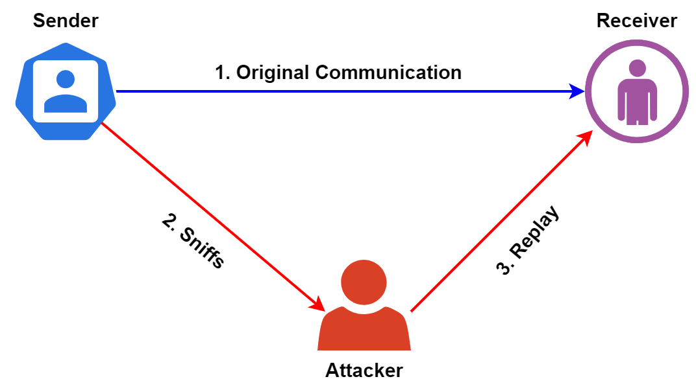

# عنوان

## نویسندگان

- آنیتا علیخانی
- علیرضا رحمانی
- علی اسلامی نژاد

# مقدمه

# Replay attacks
Replay attack یا حمله تکرار یا حمله بازپخش نوعی حمله سای است که در آن مهاجم سایبری انتقال داده را شناسایی می کند و سپس آن را به تاخیر می اندازد یا آن را تکرار می کند. هنگامی که داده ها رهگیری می شوند، دوباره به مقصد اصلی ارسال می شوند، جایی که مهاجم اکنون وانمود می کند که فرستنده اصلی است. دریافت کننده پیام احراز شده را دریافت می کند، اما پیامی است که توسط مهاجم ارسال می شود. در این صورت، پیام دو بار دریافت می شود - به همین دلیل است که به آن حمله تکرار می گویند. Replay attack به ویژه از این جهت مضر است که مهاجم سایبری حتی نیازی به رمزگشایی پیامی که مجددا ارسال می کند ندارد. با این حال، آنها هنوز هم می توانند گیرنده پیام را فریب دهند تا باور کند که پیام دریافت شده درست و همان پیام اصلی است. Replay attackها مهاجمان سایبری را قادر می‌سازد تا به شبکه‌های هدف دسترسی پیدا کنند، جایی که می‌توانند به اطلاعاتی دسترسی پیدا کنند که به راحتی قابل دسترس نبودند.

# Man in the middle attacks
حملات Man-in-the-Middle (MITM) یک نوع رایج از حملات امنیت سایبری است که به مهاجمان اجازه می دهد تا ارتباطات بین دو هدف را شنود کنند. این حمله بین دو میزبانی که به طور قانونی در ارتباط هستند انجام می شود و به مهاجم اجازه می دهد به مکالمه ای که معمولاً نباید قادر به گوش دادن به آن باشد گوش دهد، از این رو نام «مرد میانی» به آن می دهند. این حمله انواع مختلفی دارد. به عنوان مثال ممکن است از یک سایت جعلی بانکی برای گرفتن اطلاعات ورود به سیستم مالی افراد استفاده شود. در این مثال سایت جعلی میان کاربر و سایت اصلی بانک قرار دارد. در حملات MITM مهاجم در میان مسیر تغییرات را اعمال می کند و یا اینکه شنود می کند اما در حملات Replay قضیه به گونه ای دیگر است.

# منابع
>https://www.bugcrowd.com/glossary/replay-attack/

>https://www.baeldung.com/cs/replay-attacks

>https://www.rapid7.com/fundamentals/man-in-the-middle-attacks/

>https://www.rapid7.com/fundamentals/man-in-the-middle-attacks/

