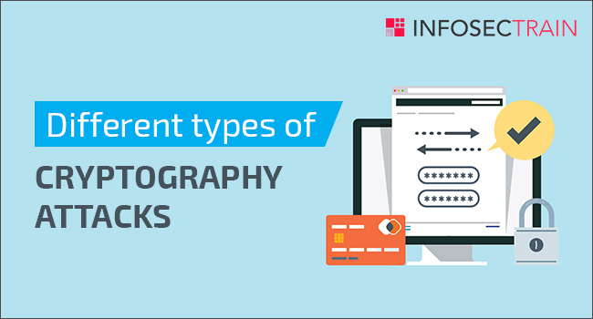
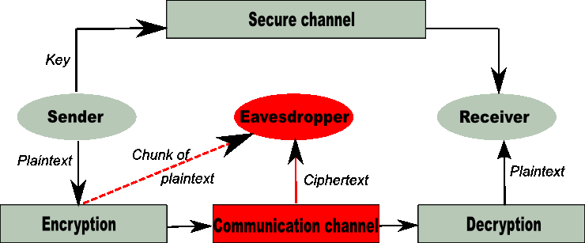

# عنوان

## نویسندگان

- آنیتا علیخانی
- علیرضا رحمانی
- علی اسلامی نژاد

# مقدمه
در زمینه رمزنگاری انواع مختلفی از حملات وجود دارد که امنیت سیستم های ارتباطی را تهدید می کند. بسته به سطح تعامل مهاجم با سیستم، این حملات را می توان به عنوان غیرفعال یا فعال طبقه بندی کرد. در این مقاله، چندین حمله از این دست را که معمولاً در حوزه رمزنگاری با آن مواجه می‌شویم، مورد بحث قرار خواهیم داد.

ابتدا، ما در مورد حمله Known-plaintext بحث خواهیم کرد، جایی که مهاجم به هر دو متن رمز شده و متن ساده مربوطه دسترسی دارد. هدف مهاجم تعیین کلید رمزگذاری مورد استفاده برای رمزگذاری متن ساده در متن رمزی است.

در مرحله بعد، به حمله Chosen-plaintext می پردازیم، جایی که مهاجم می تواند متن ساده ای را که می خواهد رمزگذاری کند انتخاب کند و متن رمز مربوطه را به دست آورد. این نوع حمله قوی تر از حمله با متن ساده شناخته می شود زیرا مهاجم کنترل بیشتری بر ورودی دارد.

سپس به بحث در مورد حمله Replay می‌پردازیم، جایی که مهاجم یک پیام معتبر را رهگیری می‌کند و سپس آن را دوباره ارسال می‌کند و باعث می‌شود گیرنده باور کند که یک پیام معتبر است.

علاوه بر این، ما حمله Man in the Middle را بررسی خواهیم کرد، جایی که مهاجم بدون اطلاع آن‌ها ارتباط بین دو طرف را رهگیری کرده و تغییر می‌دهد.

همچنین در مورد حمله Extension Length بحث خواهیم کرد، جایی که مهاجم می تواند طول پیامی را که هش شده است بدون تغییر هش اصلی افزایش دهد.

در نهایت، ما به حملات Hash Collisions برای کلیدهای Diffie-Hellman می پردازیم، جایی که مهاجم می تواند دو پیام مختلف را پیدا کند که هش یکسانی را تولید می کنند، که منجر به احتمال شکستن امنیت سیستم می شود.

هدف این مقاله ارائه یک مرور کلی از این حملات رایج در رمزنگاری و پیامدهای بالقوه آنها است.

# Known-plaintext attack

حمله متن ساده شناخته شده(known-plaintext attack) نوعی حمله در رمزنگاری است که در آن مهاجم هم به متن رمز شده(ciphertext) و هم به متن ساده(plaintext) مربوطه دسترسی دارد. هدف مهاجم تعیین کلید رمزگذاری(encryption key) مورد استفاده برای رمزگذاری متن ساده در متن رمزی است. با دسترسی به هر دو متن ساده و متن رمز، مهاجم می تواند آنها را تجزیه و تحلیل و مقایسه کند تا کلید رمزگذاری را تعیین کند.
به عنوان مثال، مهاجم ممکن است به دنبال الگوهایی در متن رمزنگاری شود که با الگوهای موجود در متن ساده مطابقت دارد. اگر الگوریتم رمزگذاری ضعیف باشد یا اگر کلید رمزگذاری به اندازه کافی قوی نباشد، مهاجم ممکن است بتواند کلید رمزگذاری را تعیین کند و سپس از آن برای رمزگشایی سایر پیام های رمزگذاری شده استفاده کند.

# Chosen-plaintext attack

در یک حمله متن ساده انتخاب شده(chosen-plaintext attack)، مهاجم می‌تواند متنی را که می‌خواهد رمزگذاری کند انتخاب کند و متن رمز مربوطه را به دست آورد. سپس مهاجم از این اطلاعات برای تعیین کلید رمزگذاری استفاده می کند. این نوع حمله قوی تر از حمله با متن ساده شناخته می شود زیرا مهاجم کنترل بیشتری بر ورودی دارد. با این کنترل اضافی، مهاجم می‌تواند به طور خاص ورودی‌های متن ساده را انتخاب کند که به آنها کمک می‌کند کلید رمزگذاری را راحت‌تر تعیین کنند.

توجه به این نکته مهم است که استفاده از الگوریتم‌ها و کلیدهای رمزگذاری قوی می‌تواند خطر حملات متن اصلی و متن اصلی را تا حد زیادی کاهش دهد. علاوه بر این، استفاده از تکنیک های رمزگذاری مانند رمزگذاری تأیید شده نیز می تواند انجام این نوع حملات را دشوارتر کند. به طور کلی، استفاده از بهترین شیوه ها در رمزنگاری برای محافظت از اطلاعات حساس و جلوگیری از حملات موفقیت آمیز مهم است.

به طور کلی، حملات متن ساده شناخته شده و حملات متن ساده انتخاب شده تهدیدی برای امنیت ارتباطات رمزگذاری شده هستند. آنها هر دو شکلی از تحلیل رمز(cryptanalysis) یا مطالعه روش هایی برای به دست آوردن محتوای پیام های رمزگذاری شده بدون دسترسی به کلید هستند. به منظور جلوگیری از این نوع حملات، استفاده از الگوریتم‌های رمزگذاری که به گونه‌ای طراحی شده‌اند که در برابر این نوع حملات ایمن باشند، و استفاده از کلیدهایی که به اندازه کافی طولانی و پیچیده هستند تا حملات brute-force را غیرممکن کنند، مهم است.

به عنوان مثال، الگوریتم‌های رمزگذاری متقارن(symmetric encryption algorithms)، مانند AES، به گونه‌ای طراحی شده‌اند که در برابر حملات متن ساده و متن اصلی انتخاب شده ایمن باشند و به طور گسترده در بسیاری از برنامه‌ها استفاده می‌شوند. با این حال، این الگوریتم ها همچنان به استفاده از یک کلید قوی نیاز دارند تا اطمینان حاصل شود که رمزگذاری به راحتی نمی تواند شکسته شود.

در مورد حملات متن ساده انتخاب شده، استفاده از رمزگذاری تایید شده(authenticated encryption) می تواند به ویژه در جلوگیری از این نوع حملات موثر باشد. رمزگذاری احراز هویت شده هم محرمانه بودن (پنهان کردن محتوای پیام) و هم یکپارچگی (جلوگیری از تغییرات غیرمجاز در پیام) را از طریق استفاده از کد احراز هویت پیام (MAC) فراهم می کند. با تأیید صحت پیام، رمزگذاری احراز هویت شده، تغییر متن ساده یا متن رمزنگاری شده را برای مهاجم دشوارتر می‌کند تا بتواند کلید رمزگذاری را تعیین کند.

به طور کلی، بهترین راه برای محافظت در برابر حملات متن ساده و متن اصلی انتخاب شده، استفاده از الگوریتم‌های رمزگذاری قوی، کلیدهای طولانی و پیچیده و روش‌های احراز هویت مانند کدهای تأیید اعتبار پیام است. تغییر منظم کلیدها و به روز رسانی الگوریتم های رمزگذاری نیز می تواند به حفظ امنیت ارتباطات رمزگذاری شده در مواجهه با تهدیدات در حال تکامل کمک کند.

# Replay attacks
حمله Replay یا حمله تکرار یا حمله بازپخش نوعی حمله سای است که در آن مهاجم سایبری انتقال داده را شناسایی می کند و سپس آن را به تاخیر می اندازد یا آن را تکرار می کند. هنگامی که داده ها رهگیری می شوند، دوباره به مقصد اصلی ارسال می شوند، جایی که مهاجم اکنون وانمود می کند که فرستنده اصلی است. دریافت کننده پیام احراز شده را دریافت می کند، اما پیامی است که توسط مهاجم ارسال می شود. در این صورت، پیام دو بار دریافت می شود - به همین دلیل است که به آن حمله تکرار می گویند. Replay attack به ویژه از این جهت مضر است که مهاجم سایبری حتی نیازی به رمزگشایی پیامی که مجددا ارسال می کند ندارد. با این حال، آنها هنوز هم می توانند گیرنده پیام را فریب دهند تا باور کند که پیام دریافت شده درست و همان پیام اصلی است. Replay attackها مهاجمان سایبری را قادر می‌سازد تا به شبکه‌های هدف دسترسی پیدا کنند، جایی که می‌توانند به اطلاعاتی دسترسی پیدا کنند که به راحتی قابل دسترس نبودند.

# Man in the middle attacks
حملات Man-in-the-Middle (MITM) یک نوع رایج از حملات امنیت سایبری است که به مهاجمان اجازه می دهد تا ارتباطات بین دو هدف را شنود کنند. این حمله بین دو میزبانی که به طور قانونی در ارتباط هستند انجام می شود و به مهاجم اجازه می دهد به مکالمه ای که معمولاً نباید قادر به گوش دادن به آن باشد گوش دهد، از این رو نام «مرد میانی» به آن می دهند. این حمله انواع مختلفی دارد. به عنوان مثال ممکن است از یک سایت جعلی بانکی برای گرفتن اطلاعات ورود به سیستم مالی افراد استفاده شود. در این مثال سایت جعلی میان کاربر و سایت اصلی بانک قرار دارد. در حملات MITM مهاجم در میان مسیر تغییرات را اعمال می کند و یا اینکه شنود می کند اما در حملات Replay قضیه به گونه ای دیگر است.

  
  # Length extension attack
هنگامی که یک هش مبتنی بر Merkle-Damgård به عنوان رمز احراز هویت پیام، پیام و طول رمز مشخص باشد، می‌تواند مورد سو استفاده قرار بگیرد. یک حمله به هر کسی اجازه می دهد اطلاعات اضافی را در انتهای پیام اضافه کند و بدون دانستن رمز، یک هش معتبر تولید کنید.
از آنجایی که HMAC از این ساختار استفاده نمی کند، هش های HMAC مستعد این حملات نیستند.
بنابراین، Length extension attack نوعی حمله است که در آن مهاجم می تواند از Hash(message1) و طول message1 برای محاسبه Hash (message1 ‖ message2) برای پیام 2 کنترل شده توسط مهاجم استفاده کند، بدون اینکه نیازی به دانستن محتوای message1 داشته باشد.
الگوریتم هایی مانند MD5، SHA-1 و بسیاری از SHA-2 ها که بر اساس ساختار Merkle-Damgård هستند، مستعد این نوع حمله هستند. نسخه‌های کوتاه‌شده SHA-2، از جمله SHA-384 و SHA-512/256، به این نوع حمله حساس نیستند.

توابع هش آسیب پذیر با گرفتن پیام ورودی و استفاده از آن برای تغییر حالت داخلی کار می کنند. پس از پردازش تمام ورودی ها، هش جدید با خروجی وضعیت داخلی تابع تولید می شود. امکان بازسازی حالت داخلی از این هش وجود دارد که سپس می توان از آن برای پردازش داده های جدید استفاده کرد. به این ترتیب، می توان پیام را گسترش داد و هش را محاسبه کرد که یک امضای معتبر برای پیام جدید است.
  
  # Hash collisions attacks for Diffie-Hellman Keys
  
  ## Hash collision چیست؟
در رمزنگاری، یک حمله برخورد به یک هش رمزنگاری سعی می کند دو ورودی را پیدا کند که مقدار هش یکسانی تولید می کنند.

تقریبا دو نوع حمله برخوردی وجود دارد:

## حمله برخورد کلاسیک
دو پیام متفاوت m۱ و m۲ را پیدا کنید به طوری که hash(m1) = hash(m2).

## حمله تصادف زنجیره ای
با توجه به دو پیشوند مختلف p۱ و p۲، دو ضمائم m۱ و m۲ را پیدا کنید به طوری که hash(p1 ∥ m1) = hash(p2 ∥ m2)، که در آن ∥ نشان دهنده عملیات الحاق است.
  
# منابع
>https://en.wikipedia.org/wiki/Known-plaintext_attack

>https://www.bugcrowd.com/glossary/replay-attack/

>https://www.baeldung.com/cs/replay-attacks

>https://www.rapid7.com/fundamentals/man-in-the-middle-attacks/
  
>https://deeprnd.medium.com/length-extension-attack-bff5b1ad2f70
  
>https://en.wikipedia.org/wiki/Collision_attack

